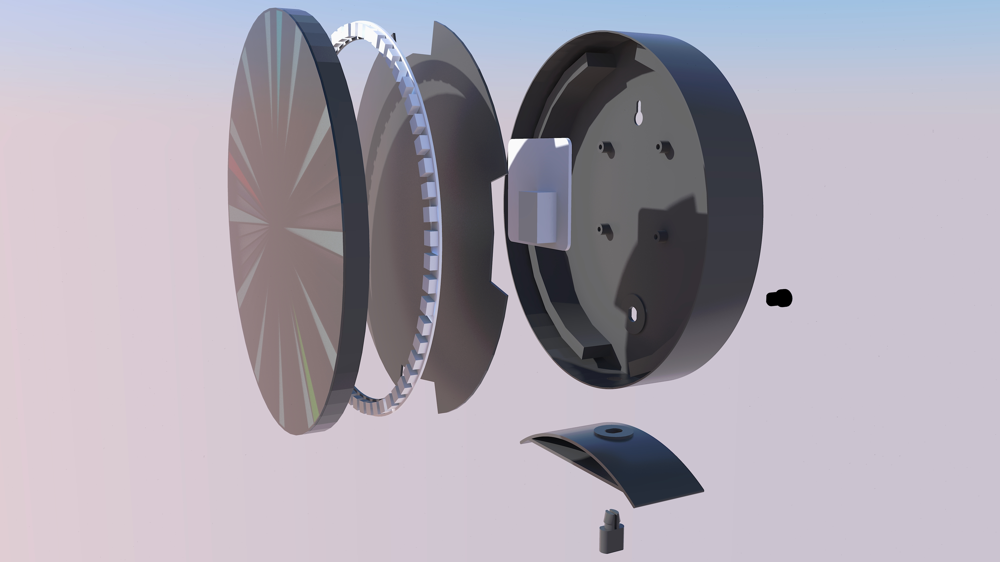
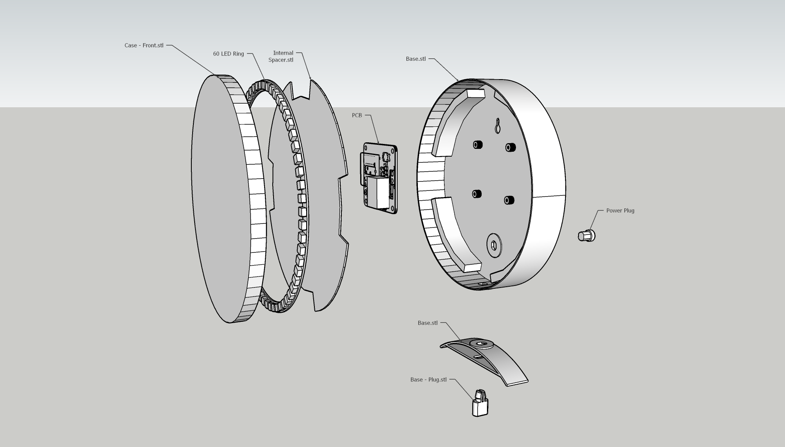
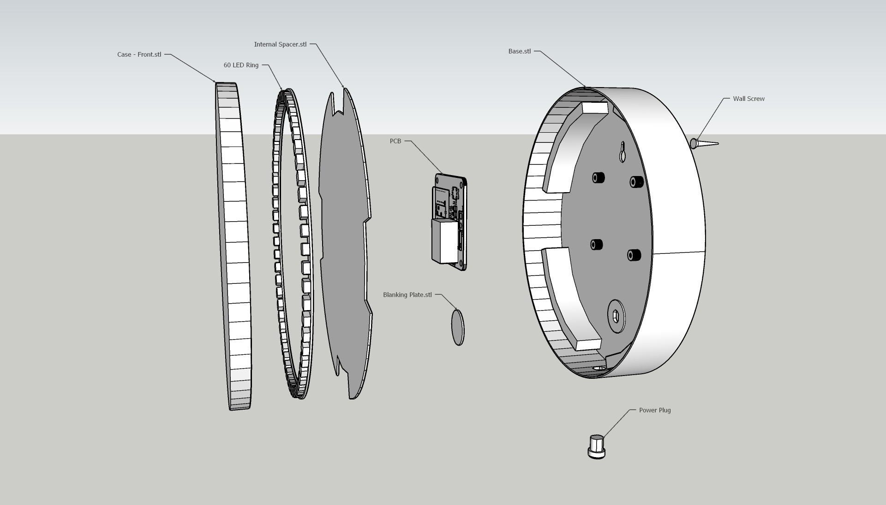

# Digilogue Clock

This is my WLED based "Digilogue" Clock. It uses a 60 LED ring to simulate an analogue style clock.

I have included all the STL files but also some 3MF for some parts. These either need supports or have specific layers to change the filament on. These are setup for a Prusa MK3s. The filamanet chages are at layer changes so no need for the MMU, just change when prompted by the printer!

Filaments I used for my project (not sponsored) are:
1. Ooznest Lucid Black
2. Ooznest Snow White
3. Ooznest Slate Grey

Filaments 1 and 2 are needed only for the clock face. Lucid black (which is a smoked like filiment) acts like a filter to increase the contrast of the display and Snow White is used to diffuse the light from the LEDs.

Filament 3 can be pretty much any solid colour you wish. I would advise against using pale, translucent or white filaments as the light will bleed between segments of the clock face. Darker colours are probably better.

## Clock Styles

The clock can be built as either a desk clock or a wall clock

### Parts needed for both
- LED Digilogue-Case-Front.stl (or preconfigered layers with .3mf)
- LED Digilogue-Case-Rear.stl (or .3mf with painted supports)
- LED Digilogue-Case-Internal Spacer.stl

### Desk Clock
- LED Digilogue-Base.stl (or .3mf with painted supports)
- LED Digilogue-Base-Plug.stl

### Wall Clock
- LED Digilogue-Blanking Plate.stl

## Electronics

This project uses my WLED Controller and which can be found at: https://github.com/chipnotic/WLED-Controller

The DC Jack I used can be found on eBay etc and is this [style](https://www.aliexpress.com/item/4000275300128.html?spm=a2g0o.productlist.0.0.61ed445etkcNXM&algo_pvid=2594685a-8ed4-49d4-aeaf-63f5876b4682&algo_exp_id=2594685a-8ed4-49d4-aeaf-63f5876b4682-10&pdp_ext_f=%7B%22sku_id%22%3A%2210000001116443737%22%7D). The holes are shaped for this particular socket.
